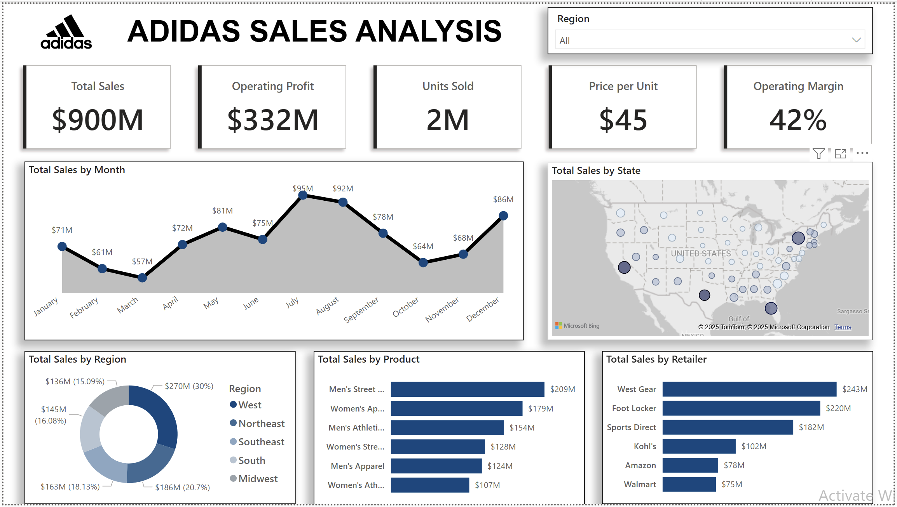

# 🏷️ Adidas Sales Analysis Dashboard (Power BI)

This project is a comprehensive Power BI dashboard that provides insights into Adidas sales performance across various dimensions — time, geography, products, and retailers. It helps visualize sales trends and optimize strategic decision-making.

---

## 📸 Dashboard Preview

---

## 🧾 Dataset Overview

The dataset used in this analysis includes the following columns:

| Column Name         | Description |
|---------------------|-------------|
| Retailer            | Name of the retail seller |
| Retailer ID         | Unique ID for each retailer |
| Invoice Date        | Date of transaction |
| Region              | Sales region |
| State               | U.S. state where sales occurred |
| City                | City of the transaction |
| Product             | Product sold |
| Price per Unit      | Selling price per unit |
| Units Sold          | Number of units sold |
| Total Sales         | Total revenue generated |
| Operating Profit    | Profit after cost deductions |
| Operating Margin    | Percentage margin of profit |
| Sales Method        | In-store / Online |

> ⚠️ Note: The dataset is fictitious and used for visualization and educational purposes only.

---

## 📊 Dashboard Features

- 📅 **Sales Trend** by Month (Line Chart)
- 🌍 **Sales by Region & State** (Map + Donut Chart)
- 📦 **Sales by Product** (Bar Chart)
- 🛒 **Retailer Performance** (Bar Chart)
- 📈 **KPI Cards**:
  - Total Sales: `$900M`
  - Operating Profit: `$332M`
  - Units Sold: `2M`
  - Price per Unit: `$45`
  - Operating Margin: `42%`
- 🎯 **Region Filter** for interactive drill-down

---

## 🧰 Tools & Technologies

- **Power BI Desktop**
- **DAX (Data Analysis Expressions)**
- **Power Query (ETL & Data Cleaning)**

---

